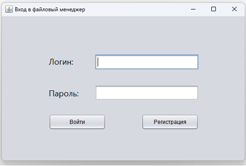
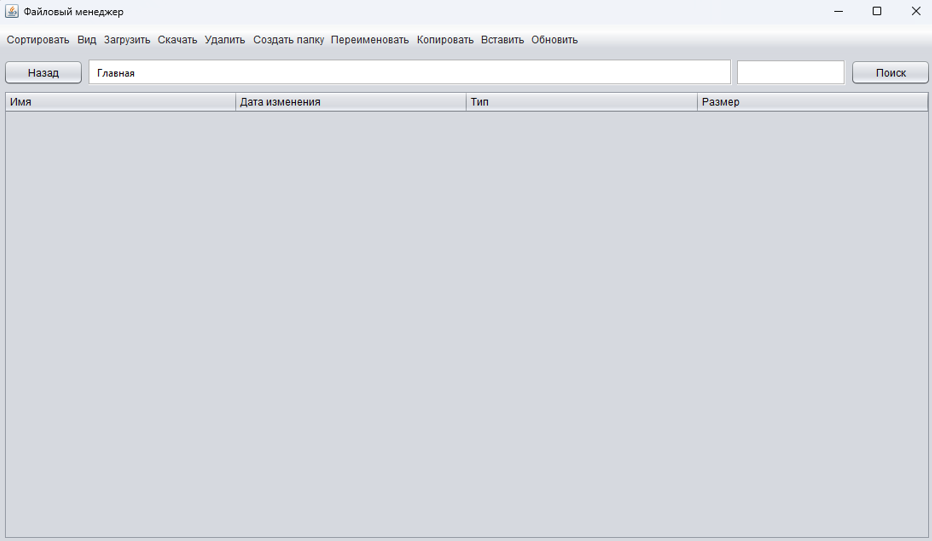

# Файловый менеджер
Java-приложение «**Файловый менеджер**» — это защищённая клиент-серверная система для удалённого хранения и управления файлами. Клиент с GUI на Swing предоставляет интуитивные операции (загрузка, скачивание, поиск, сортировки и т.д.), а сервер обрабатывает запросы, хранит данные пользователей в SQLite и шифрует весь трафик гибридной схемой RSA-4096 + AES-256-GCM.
## Требования
| Софт              | Версия      |
|-------------------|-------------|
| JDK               | 17 или выше |
## Ключевые возможности
| Категория            | Возможность |
|----------------------|-------------|
| Учётные записи       | Регистрация и аутентификация с хранением BCrypt-хэшей |
| Навигация            | «Хлебные крошки», просмотр в виде списка/таблицы, сортировка по имени/дате/типу/размеру |
| Операции с папками   | Создание, переименование, рекурсивное удаление |
| Операции с файлами   | Копирование (с автодополнением имени при конфликте), вставка, загрузка, скачивание |
| Поиск                | Рекурсивный поиск по подстроке с мгновенной выдачей результатов |
| Защита данных        | RSA-4096 для обмена ключом, AES-256-GCM для контента; весь канал шифруется |
| Масштабируемость     | Серверная многопоточность (Thread-per-Connection + ExecutorService) |
| Хранилище метаданных | SQLite DB (`users.db`) в `server_data/users` |
| Каталоги пользователей | Все каталоги пользователей хранятся в `server_data/catalogs`
## Стек технологий
- **Java 17+**
- **Swing** — графический интерфейс
- **java.net.Socket / ServerSocket** — TCP-транспорт
- **Java Collections, Streams, Concurrency API**
- **BCrypt** — безопасное хеширование паролей
- **RSA & AES (javax.crypto)** — гибридное шифрование
- **SQLite + JDBC** — лёгкая СУБД на сервере
- **NetBeans** — IDE
## Скриншоты работы

